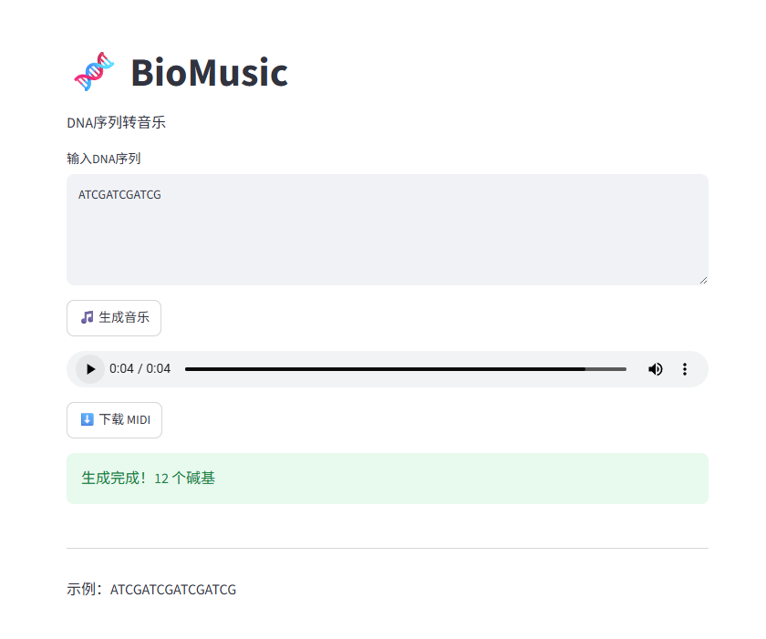
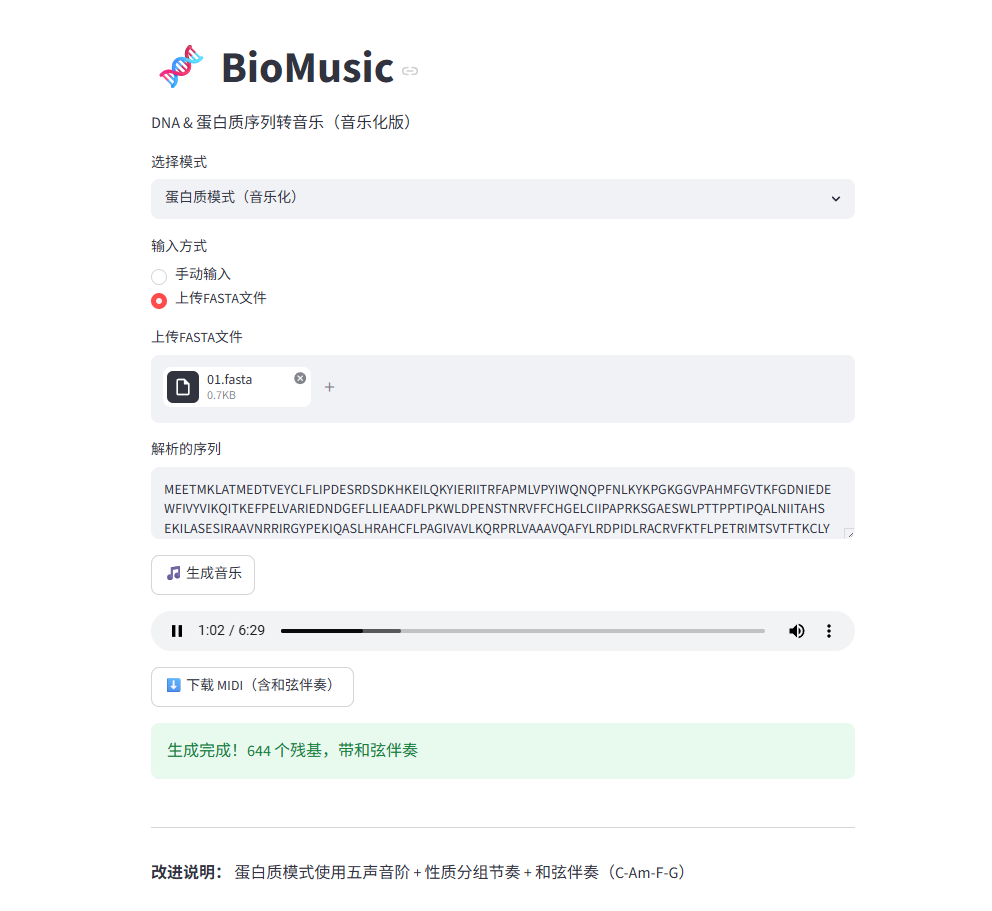

# 🧬 BioMusic

将 DNA 和蛋白质序列转化为音乐的生物信息学工具。

## 功能

- **DNA 模式**：将 ATCG 碱基映射为音符
- **蛋白质模式**：20 种氨基酸按疏水性/亲水性分组映射，五声音阶保证和谐
- **FASTA 文件上传**：直接拖入基因序列文件
- **音频可视化**：实时波形图展示
- **MIDI 导出**：下载后可导入 FL Studio、Cubase 等软件继续编辑

## 演示

### DNA 模式


### 蛋白质模式（音乐化）


## 在线演示

[🚀 点击试用](https://biomusic-v7flfv8nqzdyktpcjq4mec.streamlit.app/)

## 技术栈

- Python + Streamlit
- MIDIUtil（MIDI 生成）
- NumPy（音频合成）
- Matplotlib（可视化）

## 安装运行

```bash
pip install streamlit midiutil numpy matplotlib
streamlit run app.py

